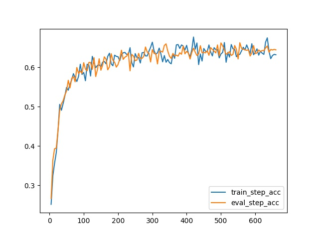
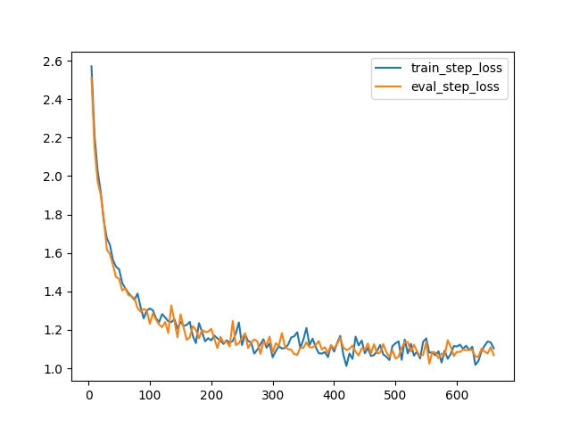

# ReorderVis For Server

## papers

```shell


```


## how to run

```shell
    整个程序分为两部分，前端和后端，本文件夹为后端程序。运行ServerToStart即可运行可解释性程序的后端，本程序已经包含了几个RNN模型作为样例，用户可直接使用。如果需要解释您自己的可解释性程序，请在ServerToStart进行配置，在theMod中声明其他的RNN模型。
    The ReorderVis contains two parts, browser side and machine learning side. This folder is responsible for machine learning and also works as an interface to communicate with the browser. Run the ServerToStart.py to establish the machine learning side. You can try our system with the RNN model we have trained. If you want to get explainability of your own model, please change the config in the ServerToStart.py.
```


## how to use

```shell
    如果你想使用我们的程序对您训练好的模型进行可解释性研究。您的可解释性模型需要满足以下要求：
      1.模型中有一个Predict函数，接收string类型的输入，输入以空格进行隔开（即可以接收 this is great 或者23452 87344 98924这种类型的输入），返回这个输入的预测值，预测值的格式应为python基本格式（list/float等），这个Predict函数一次只处理一个输入。具体操作，可参照本文件夹中的RNNModelPredict文件进行修改。
      2.在ServerToStart文件中引入这个模型，修改theMod函数
```

## output

confusion  
  
epoch acc  
  
epoch loss  
  
step acc  
  
step loss  
  

output  
```shell


```
